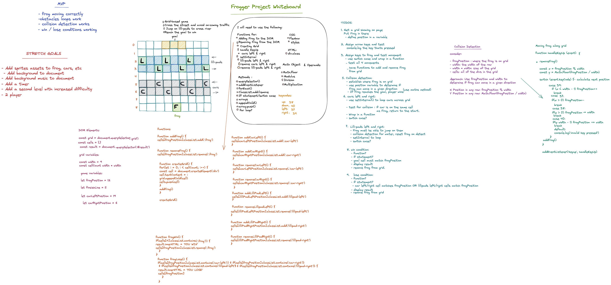
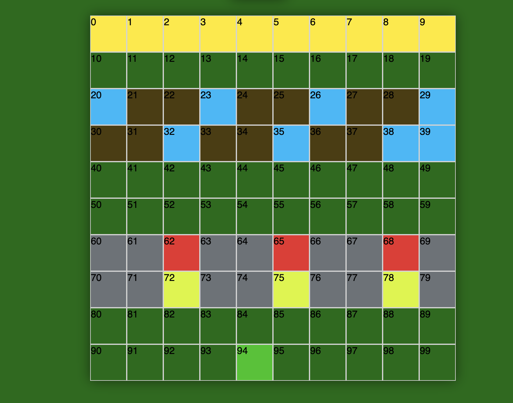
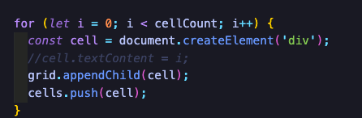
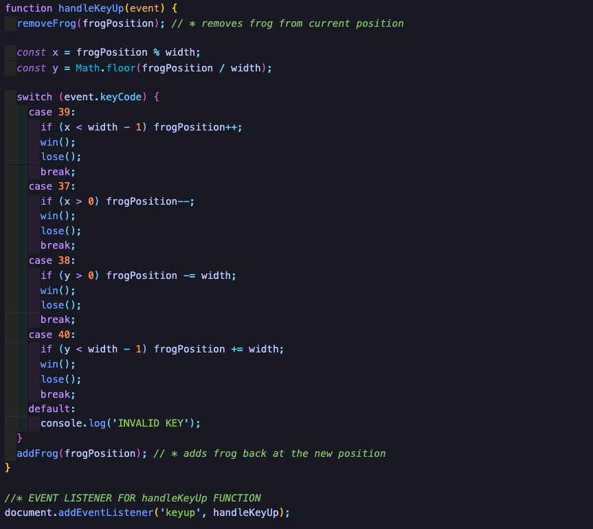
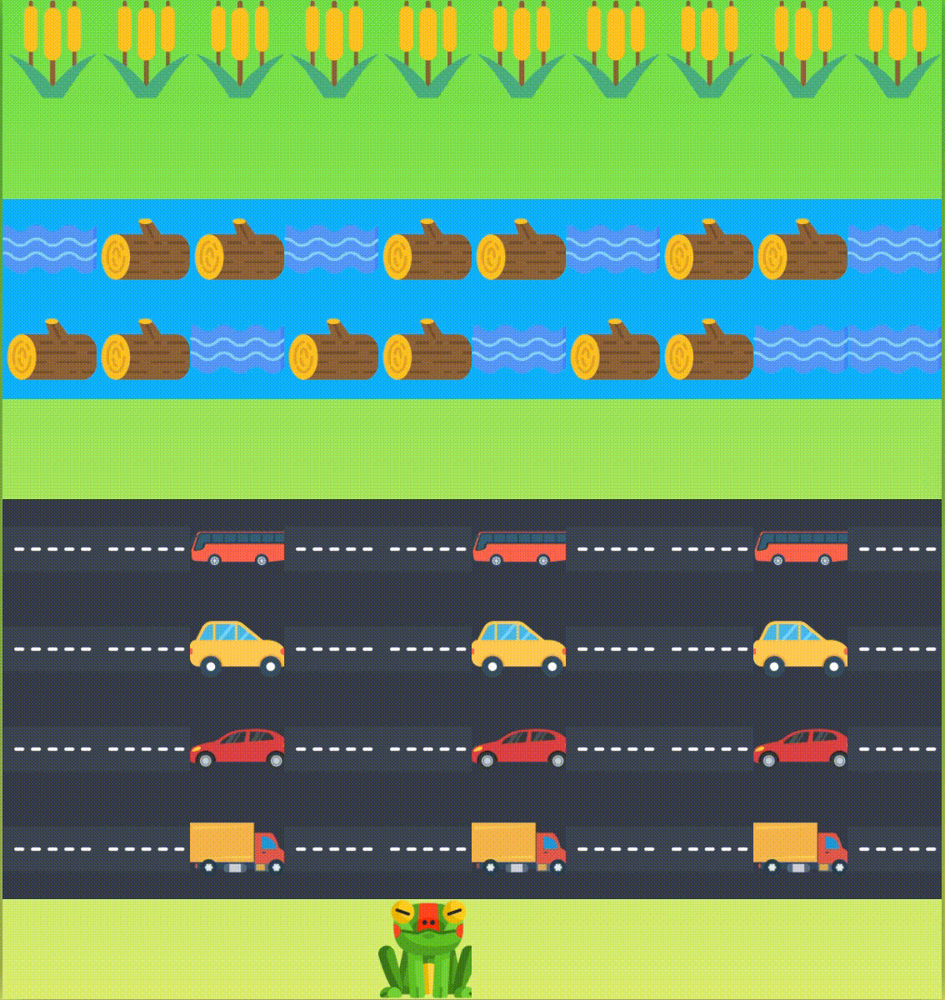
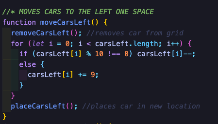
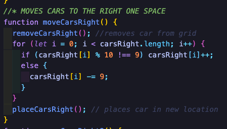
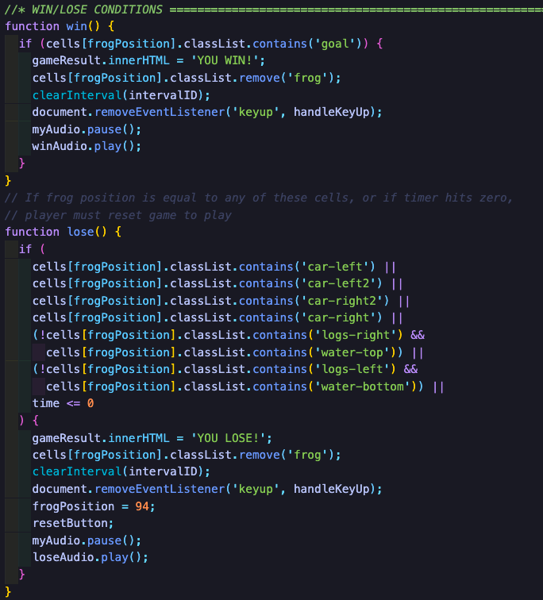

# Project 1

For my first project in the General Assembly Software Engineering Immersive Course, i was tasked to make grid-based game inspired by the classic arcade title **Frogger**, utilising the JaavaScript skills i have acquired up to this point.

### Project Duration: 7 Days

### Technologies Required: HTML, CSS, JavaScript ES6+

### Link to the game: [Frogger](https://mstephanou.github.io/ga-project-1/)

# Brief

**Frogger** is a grid-based game where the player - _a frog_ - starts at the bottom of the grid, and must travel to the top of the grid to beat the game. The player must pass two obstacles before reaching the goal:

1. The first obstacle is a road in which cars will be travelling left and right. The player must cross the road while avoiding the cars.

2. The second obstacle is a river, where there will be logs floating left and right.
   The player must cross the river while avoiding the water. This will act as the reverse of the first obstacle - instead of avoiding the logs the player must get on them to cross to the other side and reach the goal.

In the Frogger brief, the requirements for completion were:

- The game should be playable for one player.
- The obstacles should be auto-generated.

# Day 1

I spent most of the day planning out how i wanted tp tackle the project. I sketched a rough grid design for the game, and considered which methods could potentially be useful to achieve my goals

Please find attached a whiteboard mock-up of how i planned to build this game, utilising the skills i have learned so far.

# Day 2

With my MVP goals in mind, my first task was to create a grid that would be the basis for the game board, and would house all of the moving parts inside. To acheive this i created and empty array and passed that array into a forLoop, creating new divs via the DOM and then add those new divs onto the grid on each cycle.

 
 

# Day 3

With my grid created, i then moved onto the first requirement for MVP - write logic for the player to move.
To acheive this i wrote a function that handled an eventListener that ran checks on each new key press against the frogs movement.

 
 

# Days 4 & 5

These were the most challenging days for me. I had to figure out the functionality for moving the obastacles automatically whilst factoring in the collision detection for the cars, and for the water. Knowing i had to automate obstacles moving from right to left, i created functions for every row that contained cars, logs, rows and water. I had a eureka moment when i realised that i could implement similar logic used to move the frog, to my obstacles.

 
 

# Days 6 & 7

With my MVP acheived, i spent most of the days researching royalty-free sprites and .wav files to add to my game. This process i feel was not only enjoyable but important, becuase they add more depth to the players experience.

# Featured Code

### win/lose conditions

I was particularly proud of these becuase i felt they handled quite complex computations, accounting for the players movement and running concurrent checks with each keypress

 

 

 

# Hurdles

I faced a major hurdle preventing

<a href="https://www.flaticon.com/free-icons/frog" title="frog icons">Frog icons created by Freepik - Flaticon</a> 
<a href="https://www.flaticon.com/free-icons/road" title="road icons">Road icons created by Smashicons - Flaticon</a> 
<a href="https://www.flaticon.com/free-icons/reeds" title="reeds icons">Reeds icons created by Good Ware - Flaticon</a> 
<a href="https://www.flaticon.com/free-icons/river" title="river icons">River icons created by Freepik - Flaticon</a> 
<a href="https://www.flaticon.com/free-icons/wood" title="wood icons">Wood icons created by Good Ware - Flaticon</a> 
<a href="https://www.flaticon.com/free-icons/car" title="car icons">Car icons created by vectorsmarket15 - Flaticon</a> 
<a href="https://www.flaticon.com/free-icons/car" title="car icons">Car icons created by Vectors Market - Flaticon</a> 
<a href="https://www.flaticon.com/free-icons/bus" title="bus icons">Bus icons created by DinosoftLabs - Flaticon</a> 
<a href="https://www.flaticon.com/free-icons/truck" title="truck icons">Truck icons created by BZZRINCANTATION - Flaticon</a> 

Background music from PlayOnLoop.com
Licensed under Creative Commons by Attribution 4.0
