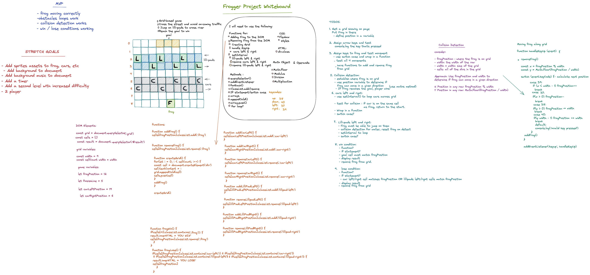

# Project 1

For my first GA project, i will be aiming to make a fully working grid-based game inspired by the classic arcade title **Frogger**

Frogger is a game where the player - _a frog_ - starts at the bottom of the grid, and must travel to the top of the grid to beat the game. The player must pass two obstacles before reaching the goal:

1. The first obstacle is a road in which cars will be travelling left and right. The player must cross the road while avoiding the cars.

2. The second obstacle is a river, where there will be lillipads floating left and right.
   The player must cross the river while avoiding the water. This will act as the reverse of the first obstacle - instead of avoiding the lillipads the player must get on them to cross to the other side and reach the goal.

Please find attached my whiteboard mock-up of how i plan to build this game, utilising the skills i have learned so far.

